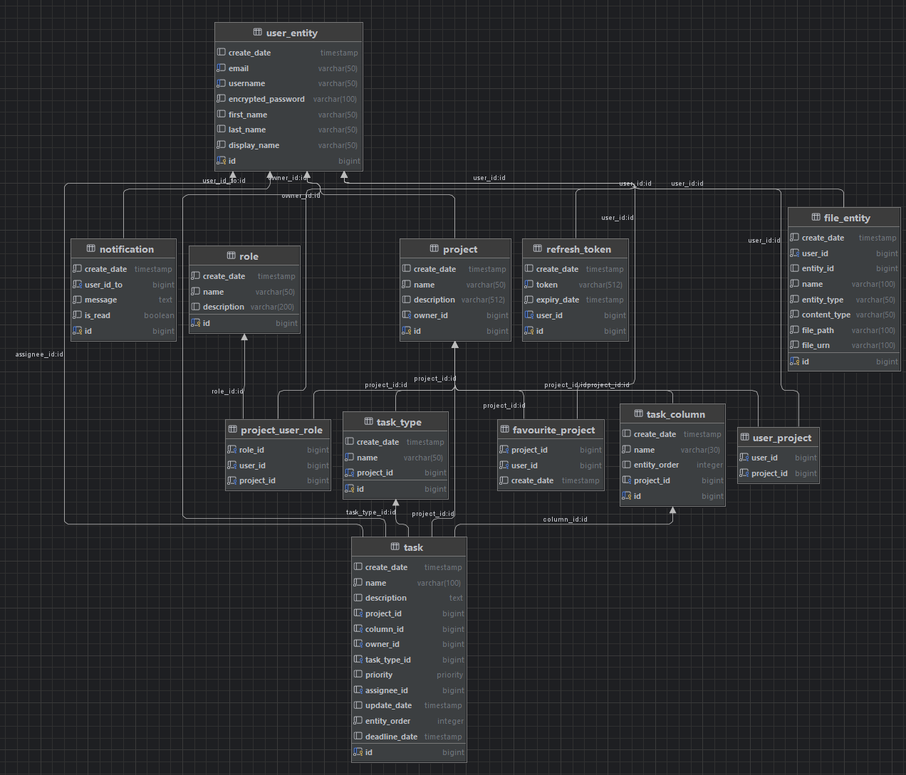
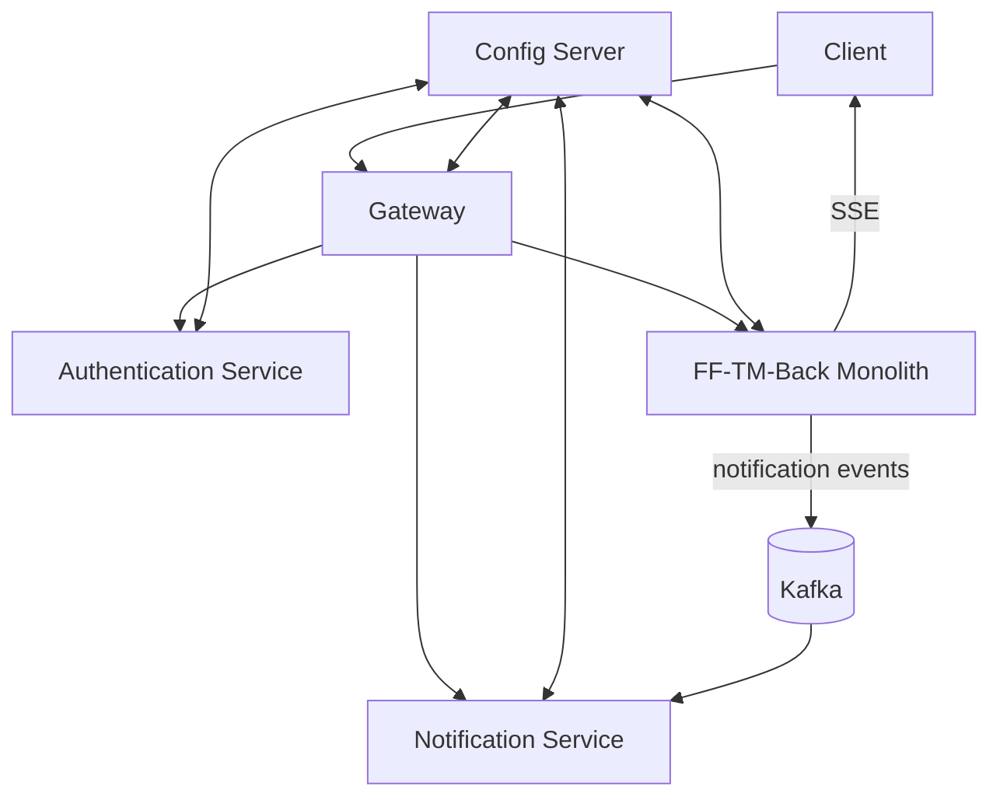

# FEBFES TASK MANAGER BACK

## Technology stack

- **Java 17** and **Spring Boot 3** for all services
- **Spring Security**, **JPA**, **Validation**, **WebFlux** and **WebSocket**
- **Spring Cloud** (Config Server and Gateway)
- **JWT** based authentication
- **PostgreSQL** with **Liquibase** migrations
- **MapStruct** for DTO mapping
- **Quartz** scheduler
- **Kafka** messaging
- **Micrometer** and **Zipkin** for tracing
- **Docker** and **Kubernetes** deployment
- **JUnit 5**, **Mockito**, **Testcontainers** for tests
- Uses **Lombok** to reduce boilerplate

### Folder structure

- `authentication` – microservice for user authentication
- `config-server` – centralized configuration service
- `ff-tm-back` – main monolithic application
- `gateway` – API gateway for routing requests
- `notification` – service for sending notifications via Kafka and SSE
- `admin-server` – Spring Boot Admin UI service
- `docker` – Dockerfiles and compose configuration
- `docs` – project documentation and diagrams
- `k8s` – Kubernetes manifests
- `scripts` – helper deployment scripts

All running services register with the Admin UI available at
`http://localhost:8095`.

## Running locally (IntelliJ IDEA):

1. Select Spring Boot -> Application
2. Expand "Modify options" -> select "Shorten command line"  -> expand "Shorten command line" -> select "classpath file"
3. Copy the following Java VM options at Applications VM options field
4. "Active profiles" -> dev

### Required VM options

db.url = your created postgres db url

db.username = your postgres username

db.password = your postgres password

jwt.secret = jwt secret key

```
-Dspring.datasource.url=db.url
-Dspring.datasource.username=db.username
-Dspring.datasource.password=db.password
-Djwt.secret=jwt.secret
```

## Swagger

Swagger is available at: http://localhost:8090/api/swagger-ui/index.html#/

## Docker

build: `docker build . --tag=ff-tm-back:latest -f docker/Dockerfile`

run: `docker run -p 8090:8090 --env-file docker/.env --name ff-tm-back ff-tm-back:latest`

docker-compose: `docker-compose up - d` (from `/docker` folder)

## Database scheme



## Microservice interaction scheme



## Style

### Branch naming

New branch: {type of task}/{task number}/{short description}

For example: feature/12/added-new-entity

### Commit naming

New commit: {task number} - {short description}

For example: 12 - added new entity

## Liquibase

### Adding new migrations

Create new .yaml file in [changes](src%2Fmain%2Fresources%2Fdb%2Fchangelog%2Fchanges)

#### New migration naming

The migration name should be like this: `<year>.<month>.<sequence_number>-<short_description>.yaml`

Example: 2023.03.01-create-task-table.yaml. Year and month of
creation are 2023 and 3 (March). Sequence number is 1, because
it's the first migration in March. Short description: created
new table for tasks.

#### View changes

If changes are made in the view, or a new view is created, a
new file must be created in the folder [view](src%2Fmain%2Fresources%2Fdb%2Fchangelog%2Fview) for this

### Rollback migrations

Not currently supported
